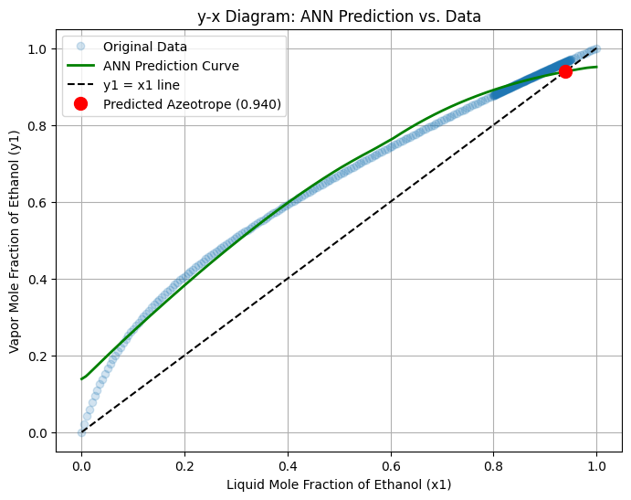
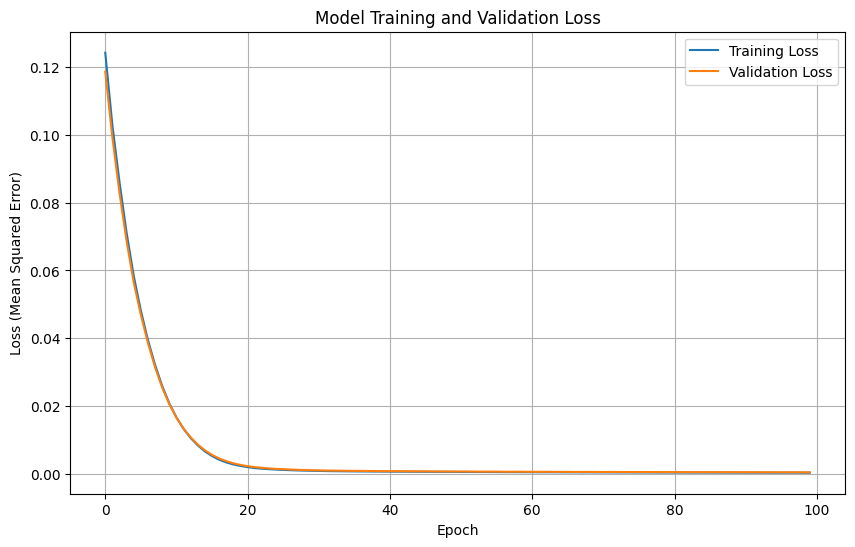
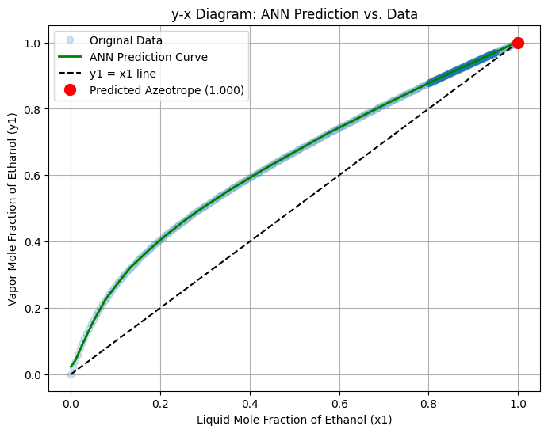
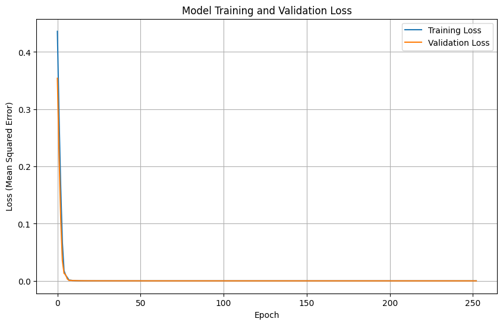

# ANN Surrogate Modeling for Binary Azeotropic VLE

This project develops an Artificial Neural Network (ANN) to serve as a surrogate model for predicting the Vapor-Liquid Equilibrium (VLE) of the non-ideal Ethanol-Water binary system. The primary objective is to train the model on thermodynamically generated data and evaluate its ability to accurately predict the vapor composition and identify the system's azeotrope.

This work was completed as a screening task for the FOSSEE Autumn Internship.

## Project Overview

Modeling azeotropic systems with traditional thermodynamic models can be computationally expensive. This project demonstrates the use of a neural network to learn this complex, non-ideal behavior from a generated dataset.

The workflow consists of four main phases:

1.  **Dataset Generation:** A high-quality, synthetic dataset for the Ethanol-Water system at 1 atm was programmatically generated using the Wilson and Antoine thermodynamic models.
2.  **Preprocessing:** The data was cleaned, split into training, validation, and test sets, and normalized for optimal model performance.
3.  **Model Development:** Two ANN architectures (a baseline and an improved, more complex version) were built and trained using TensorFlow/Keras.
4.  **Evaluation & Analysis:** The models were evaluated based on their overall predictive accuracy (RMSE) and, most importantly, their ability to correctly identify the azeotropic point.

## Results and Analysis

A key finding of this project was the trade-off between a model's general accuracy and its ability to capture a specific physical phenomenon. While the more complex "Improved ANN" had a better overall error score, the simpler "Baseline ANN" was more successful at the primary task of identifying the azeotrope.

| **Model** | **RMSE** | **Predicted Azeotrope (x1)** | **Predicted Azeotrope (T °C)** |
| --------------------------- | -------- | ---------------------------- | ------------------------------ |
| **Raoult's Law (Baseline)** | 0.0435   | N/A                          | N/A                            |
| **Baseline ANN** | 0.0264   | **0.9399** | 79.62                          |
| **Improved ANN** | **0.0029** | 1.0000                       | 78.98                          |
| **Literature Value** | -        | 0.894                        | 78.2                           |

The **Baseline ANN** proved superior for the main objective of azeotrope detection. The **Improved ANN**, while achieving a better statistical fit across all data points, failed in this key area, likely due to overfitting. This highlights that a lower global error metric does not always guarantee better performance on a specific, physically significant prediction.

## Model Performance Visualizations

### Baseline ANN Model

**Azeotrope Prediction (y-x Diagram):**



*The baseline model successfully identifies an azeotrope close to the literature value.*

**Training & Validation Loss:**



*The loss curves converge smoothly, indicating good model training.*

### Improved ANN Model

**Azeotrope Prediction (y-x Diagram):**



*The improved model fits the data very closely but fails to find the azeotrope, suggesting overfitting.*

**Training & Validation Loss:**



*The training loss drops rapidly to near zero, while the validation loss plateaus, which can be a sign of overfitting.*

## How to Run the Project

To replicate this project, follow the steps below:

**1. Clone the repository:**

```
git clone <repository-url>
cd <repository-directory>
```

**2. Create a virtual environment:**

```
python -m venv venv
source venv/bin/activate  # On Windows, use `venv\Scripts\activate`
```

**3. Install dependencies:**
The `requirements.txt` file lists all the necessary libraries.

```
pip install -r requirements.txt
```

**4. Run the Jupyter Notebooks:**
Launch Jupyter Lab and open the notebook files to see the step-by-step process.

```
jupyter lab
```

You can then run the cells in `Baseline Model.ipynb` and `Improved Model.ipynb` to see the full workflow from data generation to final analysis.

## Technologies Used

  * Python
  * TensorFlow / Keras
  * Scikit-learn
  * NumPy
  * Pandas
  * Matplotlib
  * JupyterLab
